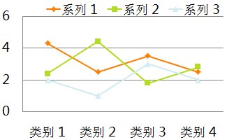
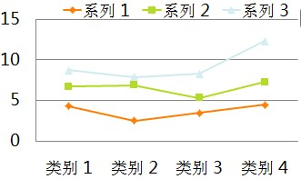
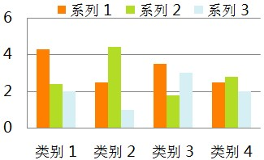
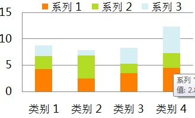
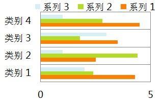
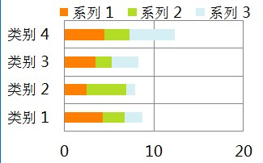
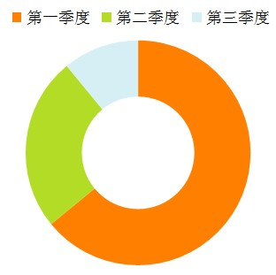

# 百度图表库标准（1.0）


## 简介

图表在各种类型的产品中都有应用，本文档主要的设计目标是规范前端图表库的标准图表类型、接口、数据格式及样式设置，使之容易被理解、使用和维护。

同时，希望通过这次标准化，推动创建出可用的标准图表库，使之能更快捷地应用到各个项目中。

### 编撰

林志峰、赵庶、erik、刘阳、杨冬

本文档由`百度Flash组`与`商业运营体系前端技术组`联合审校发布。

### 要求

在本文档中，使用的关键字会以中文+括号包含的关键字英文表示： *必须(MUST)* 。关键字"MUST", "MUST NOT", "REQUIRED", "SHALL", "SHALL NOT", "SHOULD", "SHOULD NOT", "RECOMMENDED", "MAY", and "OPTIONAL"被定义在rfc2119中。

## 名词解析

### 基本名词


<table>
    <thead>
        <tr>
            <td>名词</td>
            <td>描述</td>
        </tr>
    </thead>
    <tbody>

        <tr>
            <td> chart </td>
            <td> 是指一个完整的图表，如折线图，饼图等“基本”图表类型或由基本图表组合而成的“混搭”图表，可能包括坐标轴、图例等 </td>
        </tr>

        <tr>
            <td> axis </td>
            <td> 直角坐标系中的一个坐标轴，坐标轴可分为类目轴和数值轴 </td>
        </tr>

        <tr>
            <td> xAxis </td>
            <td> 直角坐标系中的横轴，通常并默认为类目轴 </td>
        </tr>

        <tr>
            <td> yAxis </td>
            <td> 直角坐标系中的纵轴，通常并默认为数值轴 </td>
        </tr>

        <tr>
            <td> grid </td>
            <td> 直角坐标系中除坐标轴外的绘图网格 </td>
        </tr>

        <tr>
            <td> tooltip </td>
            <td> 提示框 </td>
        </tr>

        <tr>
            <td> legend </td>
            <td> 图例 </td>
        </tr>

        <tr>
            <td> series </td>
            <td> 数据系列 </td>
        </tr>
    </tbody>
</table>


### 图表名词


<table>
    <thead>
        <tr>
            <td>名词</td>
            <td>描述</td>
        </tr>
    </thead>
    <tbody>

        <tr>
            <td> line </td>
            <td> 折线图，堆积折线图，面积图，堆积面积图 </td>
        </tr>

        <tr>
            <td> bar </td>
            <td> 柱形图，堆积柱形图，条形图，堆积条形图 </td>
        </tr>

        <tr>
            <td> scatter </td>
            <td> 散点图，气泡图 </td>
        </tr>

        <tr>
            <td> pie </td>
            <td> 饼图，圆环图 </td>
        </tr>

        <tr>
            <td> radar </td>
            <td> 雷达图，填充雷达图 </td>
        </tr>
    </tbody>
</table>


## 图表类型

图表库标准包含单图表类型的标准图表以及多图表类型混合的混搭图表：


### line

<table>
    <thead>
        <tr>
            <td>折线图</td>
            <td>堆积折线图</td>
            <td>面积图</td>
            <td>堆积面积图</td>
        </tr>
    </thead>
    <tbody>

        <tr>
            <td>  </td>
            <td>  </td>
            <td>  </td>
            <td>  </td>
        </tr>
    </tbody>
</table>


### bar

<table>
    <thead>
        <tr>
            <td>柱形图</td>
            <td>堆积柱形图</td>
            <td>条形图</td>
            <td>堆积条形图</td>
        </tr>
    </thead>
    <tbody>

        <tr>
            <td>  </td>
            <td>  </td>
            <td>  </td>
            <td>  </td>
        </tr>
    </tbody>
</table>


### scatter

<table>
    <thead>
        <tr>
            <td>散点图</td>
            <td>气泡图</td>
        </tr>
    </thead>
    <tbody>

        <tr>
            <td>  </td>
            <td>  </td>
        </tr>
    </tbody>
</table>


### pie

<table>
    <thead>
        <tr>
            <td>饼图</td>
            <td>圆环图</td>
        </tr>
    </thead>
    <tbody>

        <tr>
            <td>  </td>
            <td>  </td>
        </tr>
    </tbody>
</table>


### radar

<table>
    <thead>
        <tr>
            <td>雷达图</td>
            <td>填充雷达图</td>
        </tr>
    </thead>
    <tbody>

        <tr>
            <td>  </td>
            <td>  </td>
        </tr>
    </tbody>
</table>


## 初始化

图表库实现 *必须(MUST)* 为多实例的，实例选项 *应当(SHOULD)* 在新建时传入，同时 *可选(OPTIONAL)* 的在实例新建后通过实例方法setOption（见[方法](#方法 "")）传入，两种初始化方式最终产出效果 *必须(MUST)* 是等价的，即如下两组代码产出效果相同。

```javascript
//初始化实例时传入选项
var myChart = new echarts(option);

//初始化实例选项为空，通过实例方法传入选项
var myChart = new echarts();
myChart.setOption(option);
```

同时，在实例中任何个性化选项 *不得(MUST NOT)* 影响其他已存在或未来生成的实例。

## 方法


<table>
    <thead>
        <tr>
            <td>名称</td>
            <td>描述</td>
        </tr>
    </thead>
    <tbody>

        <tr>
            <td> {void} setOption( {Object} option ) </td>
            <td> 万能接口，配置图表实例任何可配置选项（详见 <a href="#Option">option</a> ），多次调用时option选项 *必须(MUST)* 是合并（merge）的 </td>
        </tr>

        <tr>
            <td> {void} setSeries( {Array} series ) </td>
            <td> 数据接口，驱动图表生成的数据内容（详见 <a href="#Series">series</a> ），效果 *应当(SHOULD)* 等同调用setOption({series:{...}}) </td>
        </tr>

        <tr>
            <td> {void} on( {string} eventName, {Function} eventListener ) </td>
            <td> 事件绑定， *必须(MUST)* 支持事件有：click，hover </td>
        </tr>

        <tr>
            <td> {void} un( {string} eventName, {Function} eventListener ) </td>
            <td> 事件解绑定 </td>
        </tr>

        <tr>
            <td> {void} showLoading( {Object} loadingOption) </td>
            <td> 过渡控制（详见 <a href="#Loadingoption">loadingOption</a> ），显示loading（读取中） </td>
        </tr>

        <tr>
            <td> {void} hideLoading( {void} ) </td>
            <td> 过渡控制，隐藏loading（读取中） </td>
        </tr>

        <tr>
            <td> {void} clear( {void} ) </td>
            <td> 清空绘画内容，清空后实例可用 </td>
        </tr>

        <tr>
            <td> {void} dispose( {void} ) </td>
            <td> 释放图表实例，释放后实例不再可用 </td>
        </tr>
    </tbody>
</table>


## 选项

### option

图表选项，包含图表实例任何可配置选项


<table>
    <thead>
        <tr>
            <td>名称</td>
            <td>描述</td>
        </tr>
    </thead>
    <tbody>

        <tr>
            <td> {Array} color </td>
            <td> 数值系列的颜色列表，默认为null则采用内置颜色，可配数组，eg：['#87cefa', 'rgba(123,123,123,0.5)','...']，当系列数量个数比颜色列表长度大时将循环选取 </td>
        </tr>

        <tr>
            <td> {Object} legend </td>
            <td> 图例（详见 <a href="#Legend">legend</a> ），每个图表最多仅有一个图例，混搭图表共享 </td>
        </tr>

        <tr>
            <td> {Object} tooltip </td>
            <td> 提示框（详见 <a href="#Tooltip">tooltip</a> ）,鼠标悬浮交互时的信息提示 </td>
        </tr>

        <tr>
            <td> {Object} grid </td>
            <td> 直角坐标系内绘图网格（详见 <a href="#Grid">grid</a> ） </td>
        </tr>

        <tr>
            <td> {Array} xAxis </td>
            <td> 直角坐标系中横轴数组（详见 <a href="#Xaxis">xAxis</a> ），数组中每一项代表一条横轴坐标轴，标准（1.0）中规定最多同时存在2条横轴 </td>
        </tr>

        <tr>
            <td> {Array} yAxis </td>
            <td> 直角坐标系中纵轴数组（详见 <a href="#Yaxis">yAxis</a> ），数组中每一项代表一条纵轴坐标轴，标准（1.0）中规定最多同时存在2条纵轴 </td>
        </tr>

        <tr>
            <td> {Array} series </td>
            <td> 驱动图表生成的数据内容（详见 <a href="#Series">series</a> ），数组中每一项代表一个系列的特殊选项及数据 </td>
        </tr>
    </tbody>
</table>


### legend

图例，每个图表最多仅有一个图例


<table>
    <thead>
        <tr>
            <td>名称</td>
            <td>默认值</td>
            <td>描述</td>
        </tr>
    </thead>
    <tbody>

        <tr>
            <td> {string} orient </td>
            <td> 'horizontal' </td>
            <td> 布局方式，默认为水平布局，可选为：'horizontal' &brvbar; 'vertical' </td>
        </tr>

        <tr>
            <td> {string} &brvbar; {number} x </td>
            <td> 'center' </td>
            <td> 水平安放位置，默认为全图居中，可选为：'center' &brvbar; 'left' &brvbar; 'right' &brvbar; {number}（x坐标，单位px） </td>
        </tr>

        <tr>
            <td> {string} &brvbar; {number} y </td>
            <td> 'top' </td>
            <td> 垂直安放位置，默认为全图顶端，可选为：'top' &brvbar; 'bottom' &brvbar; 'center' &brvbar; {number}（y坐标，单位px） </td>
        </tr>

        <tr>
            <td> {string} backgroundColor </td>
            <td> '#fff' </td>
            <td> 图例背景颜色 </td>
        </tr>

        <tr>
            <td> {string} borderColor </td>
            <td> '#333' </td>
            <td> 图例边框颜色 </td>
        </tr>

        <tr>
            <td> {number} borderRadius </td>
            <td> 4 </td>
            <td> 图例边框圆角，单位px，默认为4 </td>
        </tr>

        <tr>
            <td> {number} borderWidth </td>
            <td> 0 </td>
            <td> 图例边框线宽，单位px，默认为0（无边框） </td>
        </tr>

        <tr>
            <td> {number} &brvbar; {Array} padding </td>
            <td> 5 </td>
            <td> 图例内边距，单位px，默认各方向内边距为5，接受数组分别设定上右下左边距，同css </td>
        </tr>

        <tr>
            <td> {number} itemGap </td>
            <td> 10 </td>
            <td> 各个item之间的间隔，单位px，默认为10，横向布局时为水平间隔，纵向布局时为纵向间隔 </td>
        </tr>

        <tr>
            <td> {string} itemRender </td>
            <td> null </td>
            <td> 默认item渲染器（详见 <a href="#Series">series</a> 中itemRender描述） </td>
        </tr>

        <tr>
            <td> {Object} itemStyle </td>
            <td> null </td>
            <td> 默认item渲染样式（详见 <a href="#Series">series</a> 中itemStyle描述） </td>
        </tr>

        <tr>
            <td> {Array} data </td>
            <td> null </td>
            <td> 图例内容（详见 <a href="#LegendData">legend.data</a> ，数组中每一项代表一个item </td>
        </tr>
    </tbody>
</table>


#### legend.data

图例内容数组，数组中每一项代表一个item，数组项可为{Object}，可以完整指定一个图例item的内容：

```javascript
[
    {
        name:'xxx',                         //图例名称
        itemRender:'yyy',                 //item渲染器，详见series中itemRender描述
        itemStyle:{...}                     //item渲染样式，详见series中itemStyle描述
    }
    /*,{...}*/
]
```

当不指定itemRender或itemStyle时，则会根据name值索引[series](#Series "")中同名name所用的itemRender或itemStyle，如果上述两项都不指定则数组项可退化为{string}，即

```javascript
[
    {
        name:'xxx'
    },
    {
        name:'zzz'
    }
]
```

和

```javascript
['xxx','zzz']
```

是等价的。

当不指定itemRender或itemStyle，同时根据name值索引不到[series](#Series "")中有同名name时，则会使用[legend](#Legend "")中itemRender或itemStyle，如果此时legend.itemRender或legend.itemStyle不存在则该项图例item将不被显示

### tooltip

提示框,鼠标悬浮交互时的信息提示


<table>
    <thead>
        <tr>
            <td>名称</td>
            <td>默认值</td>
            <td>描述</td>
        </tr>
    </thead>
    <tbody>

        <tr>
            <td> {string} trigger </td>
            <td> 'item' </td>
            <td> 触发类型，默认数据触发，见下图，可选为：'item' &brvbar; 'axis' </td>
        </tr>

        <tr>
            <td> {boolean} show </td>
            <td> true </td>
            <td> 显示策略，可选为：true（显示） &brvbar; false（隐藏） </td>
        </tr>

        <tr>
            <td> {string} &brvbar; {Function} formatter </td>
            <td> null </td>
            <td> 内容格式器：{string}（Template） &brvbar; {Function}，见表格下方</td>
        </tr>

        <tr>
            <td> {string} backgroundColor </td>
            <td> 'rgba(0,0,0,0.7)' </td>
            <td> 提示背景颜色，默认为透明度为0.7的黑色 </td>
        </tr>

        <tr>
            <td> {string} borderColor </td>
            <td> '#333' </td>
            <td> 提示边框颜色 </td>
        </tr>

        <tr>
            <td> {number} borderRadius </td>
            <td> 4 </td>
            <td> 提示边框圆角，单位px，默认为4 </td>
        </tr>

        <tr>
            <td> {number} borderWidth </td>
            <td> 0 </td>
            <td> 提示边框线宽，单位px，默认为0（无边框） </td>
        </tr>

        <tr>
            <td> {number} &brvbar; {Array} padding </td>
            <td> 5 </td>
            <td> 提示内边距，单位px，默认各方向内边距为5，接受数组分别设定上右下左边距，同css </td>
        </tr>

        <tr>
            <td> {Object} textStyle </td>
            <td> null </td>
            <td> 文本样式（详见 <a href="#Textstyle">textStyle</a> ） </td>
        </tr>
    </tbody>
</table>


内容格式器formatter：

- {string}，模板（Template），其变量为：
    - {a} &brvbar; {a0} 
    - {b} &brvbar; {b0} 
    - {c} &brvbar; {c0} 
    - {d} &brvbar; {d0} （部分图表类型无此项）
    - 多值下则存在多套{a1}, {b1}, {c1}, {d1}, {a2}, {b2}, {c2}, {d2}, ...
    - 其中变量a、b、c在不同图表类型下代表数据含义为：
        - 折线（面积）图、柱状（条形）图、散点图 : a（系列名称），b（横轴值），c（纵轴值）, d（无）
        - 气泡图 : a（系列名称），b（横轴值），c（纵轴值）, d（数值）
        - 饼图、雷达图 : a（系列名称），b（数据项名称），c（数值）, d（百分比）
- {Function}，传递参数为数组，数组项同模板变量：
    - [[a, b, c, d], [a1, b1, c1, d1], ...] 

触发类型


<table>
    <thead>
        <tr>
            <td>item触发</td>
            <td>axis触发</td>
        </tr>
    </thead>
    <tbody>

        <tr>
            <td>  </td>
            <td>  </td>
        </tr>
    </tbody>
</table>


### grid

直角坐标系内绘图网格


<table>
    <thead>
        <tr>
            <td>名称</td>
            <td>默认值</td>
            <td>描述</td>
        </tr>
    </thead>
    <tbody>

        <tr>
            <td> {number} x </td>
            <td> 80 </td>
            <td> 直角坐标系内绘图网格起始横坐标，数值单位px </td>
        </tr>

        <tr>
            <td> {number} y </td>
            <td> 40 </td>
            <td> 直角坐标系内绘图网格起始纵坐标，数值单位px </td>
        </tr>

        <tr>
            <td> {number} width </td>
            <td> 600 </td>
            <td> 直角坐标系内绘图网格宽度，数值单位px </td>
        </tr>

        <tr>
            <td> {number} height </td>
            <td> 250 </td>
            <td> 直角坐标系内绘图网格高度，数值单位px </td>
        </tr>
    </tbody>
</table>


 

### xAxis

直角坐标系中横轴数组，数组中每一项代表一条横轴坐标轴。
标准（1.0）中规定最多同时存在2条横轴，单条横轴时可指定安放于[grid](#Grid "")的底部（默认）或顶部，2条同时存在时则默认第一条安放于底部，第二天安放于顶部。
坐标轴有两种类型，类目型和数值型（区别详见[axis](#Axis "")），横轴通常为类目型，但条形图时则横轴为数值型，散点图时则横纵均为数值型，具体参数详见[axis](#Axis "")。

### yAxis

直角坐标系中纵轴数组，数组中每一项代表一条纵轴坐标轴。
标准（1.0）中规定最多同时存在2条纵轴，单条纵轴时可指定安放于[grid](#Grid "")的左侧（默认）或右侧，2条同时存在时则默认第一条安放于左侧，第二天安放于右侧。
坐标轴有两种类型，类目型和数值型（区别详见[axis](#Axis "")），纵轴通常为数值型，但条形图时则纵轴为类目型，具体参数详见[axis](#Axis "")。

### axis

坐标轴有两种类型，类目型和数值型，他们的区别在于：

- 类目型：需要指定类目列表，坐标轴内有且仅有这些指定类目坐标
- 数值型：需要指定数值区间，坐标轴内包含数值区间内容全部坐标

下面是坐标轴的全部选项，其中个别选项仅在类目型或数值型时有效，请注意适用类型：


<table>
    <thead>
        <tr>
            <td>名称</td>
            <td>默认值</td>
            <td>适用类型</td>
            <td>描述</td>
        </tr>
    </thead>
    <tbody>

        <tr>
            <td> {string} type </td>
            <td> 'category' &brvbar; 'value' </td>
            <td> 通用 </td>
            <td> 坐标轴类型，横轴默认为类目型'category'，纵轴默认为数值型'value' </td>
        </tr>

        <tr>
            <td> {string} position </td>
            <td> 'bottom' &brvbar; 'left' </td>
            <td> 通用 </td>
            <td> 坐标轴类型，横轴默认为类目型'bottom'，纵轴默认为数值型'left'，可选为：'bottom' &brvbar; 'top' &brvbar; 'left' &brvbar; 'right' </td>
        </tr>

        <tr>
            <td> {boolean} boundaryGap </td>
            <td> true </td>
            <td> 类目型 </td>
            <td> 类目起始和结束两端空白策略，见下图，默认为true留空，false则顶头 </td>
        </tr>

        <tr>
            <td> {Array} boundaryGap </td>
            <td> [0, 0] </td>
            <td> 数值型 </td>
            <td> 数值轴两端空白策略，数组内数值代表百分比，[原始数据最小值与最终最小值之间的差额，原始数据最大值与最终最大值之间的差额] </td>
        </tr>

        <tr>
            <td> {number} min </td>
            <td> null </td>
            <td> 数值型 </td>
            <td> 指定的最小值，eg: 0，默认无，会自动根据具体数值调整，指定后将忽略boundaryGap[0] </td>
        </tr>

        <tr>
            <td> {number} max </td>
            <td> null </td>
            <td> 数值型 </td>
            <td> 指定的最大值，eg: 100，默认无，会自动根据具体数值调整，指定后将忽略boundaryGap[1] </td>
        </tr>

        <tr>
            <td> {number} precision </td>
            <td> 0 </td>
            <td> 数值型 </td>
            <td> 小数精度，默认为0，无小数点 </td>
        </tr>

        <tr>
            <td> {number} power </td>
            <td> 100 </td>
            <td> 数值型 </td>
            <td> 整数精度，默认为100，个位和百位为0 </td>
        </tr>

        <tr>
            <td> {number} splitNumber </td>
            <td> 5 </td>
            <td> 数值型 </td>
            <td> 分割段数，默认为5 </td>
        </tr>

        <tr>
            <td> {Object} axisLine </td>
            <td> {show : true} </td>
            <td> 通用 </td>
            <td> 坐标轴线，默认显示，属性show控制显示与否，属性lineStyle（详见 <a href="#Linestyle">lineStyle</a> ）控制线条样式 </td>
        </tr>

        <tr>
            <td> {Object} axisTick </td>
            <td> {show : false} </td>
            <td> 通用 </td>
            <td> 坐标轴小标记，默认不显示，属性show控制显示与否，属性length控制线长，属性lineStyle（详见 <a href="#Linestyle">lineStyle</a> ）控制线条样式 </td>
        </tr>

        <tr>
            <td> {Object} axisLabel </td>
            <td> {show : true} </td>
            <td> 通用 </td>
            <td> 坐标轴文本标签，详见 <a href="#AxisAxislabel">axis.axisLabel</a>  </td>
        </tr>

        <tr>
            <td> {Object} splitLine </td>
            <td> {show : true} </td>
            <td> 通用 </td>
            <td> 分隔线，默认显示，属性show控制显示与否，属性lineStyle（详见 <a href="#Linestyle">lineStyle</a> ）控制线条样式 </td>
        </tr>

        <tr>
            <td> {Object} splitArea </td>
            <td> {show : false} </td>
            <td> 通用 </td>
            <td> 分隔区域，默认不显示，属性show控制显示与否，属性areaStyle（详见 <a href="#Areastyle">areaStyle</a> ）控制区域样式 </td>
        </tr>

        <tr>
            <td> {Array} data </td>
            <td> [] </td>
            <td> 类目型 </td>
            <td> 类目列表，同时也是label内容，详见 <a href="#AxisData">axis.data</a>  </td>
        </tr>
    </tbody>
</table>


boundaryGap端空白策略


<table>
    <thead>
        <tr>
            <td>设置</td>
            <td>效果</td>
        </tr>
    </thead>
    <tbody>

        <tr>
            <td> boundaryGap: true </td>
            <td>  </td>
        </tr>

        <tr>
            <td> boundaryGap: false </td>
            <td> </td>
        </tr>
    </tbody>
</table>


axis属性说明


#### axis.axisLabel

坐标轴文本标签选项


<table>
    <thead>
        <tr>
            <td>名称</td>
            <td>默认值</td>
            <td>适用类型</td>
            <td>描述</td>
        </tr>
    </thead>
    <tbody>

        <tr>
            <td> {boolean} show </td>
            <td> true </td>
            <td> 通用 </td>
            <td> 是否显示，默认为true，设为false后下面都没意义了 </td>
        </tr>

        <tr>
            <td> {string} &brvbar; {number} interval </td>
            <td> 'auto' </td>
            <td> 类目型 </td>
            <td> 标签显示挑选间隔，默认为'auto'，可选为：'auto'（自动隐藏显示不下的） &brvbar; 0（全部显示） &brvbar; {number}（用户指定选择间隔） </td>
        </tr>

        <tr>
            <td> {number} rotate </td>
            <td> 0 </td>
            <td> 通用 </td>
            <td> 标签旋转角度，默认为0，不旋转，正直为逆时针，负值为顺时针，可选为：-90 ~ 90 </td>
        </tr>

        <tr>
            <td> {number} margin </td>
            <td> 2 </td>
            <td> 通用 </td>
            <td> 坐标轴文本标签与坐标轴的间距，默认为2 </td>
        </tr>

        <tr>
            <td> {string} &brvbar; {Function} formatter </td>
            <td> null </td>
            <td> 通用 </td>
            <td> 间隔名称格式器：{string}（Template） &brvbar; {Function} </td>
        </tr>

        <tr>
            <td> {Object} textStyle </td>
            <td> null </td>
            <td> 通用 </td>
            <td> 文本样式（详见 <a href="#Textstyle">textStyle</a> ） </td>
        </tr>
    </tbody>
</table>


间隔名称格式器formatter：

- {string}，模板（Template），其变量为：
    - {value}: 内容或值
- {Function}，传递参数同模板变量：
    - eg：function(value){return "星期" + "日一二三四五六".charAt(value);'}

#### axis.data

类目型坐标轴文本标签数组，指定label内容。
数组项通常为文本，如: 

```javascript
['Jan', 'Feb', 'Mar', 'Apr', 'May', 'Jun', ..., 'Dec']
```

当需要对个别标签进行个性化定义时，数组项可用对象，如：

```javascript
[
    'Jav', 'Feb', 'Mar',
     {
        value:'Apr',            //文本内容，如指定间隔名称格式器formatter，则这个值将被作为模板变量值或参数传入
        textStyle:{             //详见textStyle
            color : 'red'
            ...         
        }
     },
    'May', '...'
] 
```

### series

驱动图表生成的数据内容，数组中每一项代表一个系列的特殊选项及数据，其中个别选项仅在部分图表类型中有效，请注意适用类型：


<table>
    <thead>
        <tr>
            <td>名称</td>
            <td>默认值</td>
            <td>适用类型</td>
            <td>描述</td>
        </tr>
    </thead>
    <tbody>

        <tr>
            <td> {string} name </td>
            <td> '' </td>
            <td> 通用 </td>
            <td> 系列名称 </td>
        </tr>

        <tr>
            <td> {Object} tooltip </td>
            <td> null </td>
            <td> 通用 </td>
            <td> 提示框样式，仅对本系列有效，如不设则用option.tooltip（详见 <a href="#Tooltip">tooltip</a> ）,鼠标悬浮交互时的信息提示 </td>
        </tr>

        <tr>
            <td> {string} type </td>
            <td> 'line' </td>
            <td> 通用 </td>
            <td> 图表类型，必要参数！可选为：折线图'line' &brvbar; 散点图'scatter' &brvbar; 柱状图'bar' &brvbar; 饼图'pie' &brvbar; 雷达图'radar' </td>
        </tr>

        <tr>
            <td> {string} itemRender </td>
            <td> null </td>
            <td> 通用 </td>
            <td> 图形项渲染器 </td>
        </tr>

        <tr>
            <td> {Object} itemStyle </td>
            <td> null </td>
            <td> 通用 </td>
            <td> 图形样式（详见 <a href="#Itemstyle">itemStyle</a> ） </td>
        </tr>

        <tr>
            <td> {string} stack </td>
            <td> null </td>
            <td> 折线图，柱状图，散点图 </td>
            <td> 组合名称，做多组数据的堆积图时使用，eg：stack:'group1'，则series数组中stack值等于'group1'的数据做堆积计算 </td>
        </tr>

        <tr>
            <td> {number} xAxisIndex </td>
            <td> 0 </td>
            <td> 折线图，柱状图，散点图 </td>
            <td>  <a href="#Xaxis">xAxis</a> 坐标轴数组的索引，指定该系列数据所用的横坐标轴 </td>
        </tr>

        <tr>
            <td> {number} yAxisIndex </td>
            <td> 0 </td>
            <td> 折线图，柱状图，散点图 </td>
            <td>  <a href="#Yaxis">yAxis</a> 坐标轴数组的索引，指定该系列数据所用的纵坐标轴 </td>
        </tr>

        <tr>
            <td> {number} barMinHeight </td>
            <td> 20 </td>
            <td> 柱状图 </td>
            <td> 柱条最小高度,防止某item的值过小而影响交互 </td>
        </tr>

        <tr>
            <td> {number} barWidth </td>
            <td> 40 </td>
            <td> 柱状图 </td>
            <td> 柱条宽度 </td>
        </tr>

        <tr>
            <td> {Array} center </td>
            <td> null </td>
            <td> 饼图 </td>
            <td> 圆心坐标，默认无（为自适应居中） </td>
        </tr>

        <tr>
            <td> {number} &brvbar; {Array} radius </td>
            <td> 100 </td>
            <td> 饼图 </td>
            <td> 半径，传数组实现环形图，[内半径，外半径] </td>
        </tr>

        <tr>
            <td> {number} startAngle </td>
            <td> 0 </td>
            <td> 饼图 </td>
            <td> 开始角度, </td>
        </tr>

        <tr>
            <td> {number} minAngle </td>
            <td> 5 </td>
            <td> 饼图 </td>
            <td> 最小角度，避免显示过小 </td>
        </tr>

        <tr>
            <td> {Array} data </td>
            <td> [] </td>
            <td> 通用 </td>
            <td> 数据（详见 <a href="#SeriesData">series.data</a> ） </td>
        </tr>
    </tbody>
</table>


#### series.data

系列中的内容数组，折线图以及柱状图中当前数组长度 *必须(MUST)* 等于所使用类目轴文本标签数组[axis.data](#AxisData "")的长度，并且他们间是一一对应的，。
数组项通常为数值，如: 

```javascript
[12, 34, 56, ..., 10, 23]
```

当某类目对应数据不存在（'不存在' != 0）时，可用'-'表示，无数据在折线图中表现为折线在该点断开，在柱状图中表现为该点无柱形，如：

```javascript
[12, '-', 56, ..., 10, 23]
```

当需要对个别内容进行个性化定义时，数组项可用对象，如：

```javascript
[
    12, 34,
    {
        value : 56,         
        tooltip:{},             //自定义特殊tooltip，仅对该item有效，详见tooltip
        itemRender:{},        //自定义特殊itemRender，仅对该item有效，同itemRender
        itemStyle:{}            //自定义特殊itemStyle，仅对该item有效，详见itemStyle
    },
    ..., 10, 23
] 
```

特别的，当图表类型为scatter（散点图或气泡图）时，其数值设置比较特殊，他的横纵坐标轴都可能为数值型，并且气泡图时需要指定气泡大小，所以scatter型图表 *应当(SHOULD)* 设置为：

```javascript
[
    {
        value : [10, 25, 5]     //[xValue, yValue, rValue]，数组内依次为横值，纵值，大小
    },
    ...,
    {
        value : [30, 128, 15],  //同上        
        tooltip:{},             //自定义特殊tooltip，仅对该item有效，详见tooltip
        itemRender:{},          //自定义特殊itemRender，仅对该item有效，同itemRender
        itemStyle:{}            //自定义特殊itemStyle，仅对该item有效，详见itemStyle
    }
] 
```

再特别的，当图表类型为饼图时，需要说明每部分数据的名称name，所以 *应当(SHOULD)* 设置为：

```javascript
[
    {
        value : 12，
        name : 'apple'          //每部分数据的名称
    },
    ...,
    {
        value : 23,             //同上
        name : 'orange'         //同上        
        tooltip:{},             //自定义特殊tooltip，仅对该item有效，详见tooltip
        itemRender:{},          //自定义特殊itemRender，仅对该item有效，同itemRender
        itemStyle:{}            //自定义特殊itemStyle，仅对该item有效，详见itemStyle
    }
] 
```

### itemStyle

图形样式，可设置图表内图形的默认样式和强调样式（悬浮悬浮时样式）：

    itemStyle: { 
        normal: {
            ...
        },
        emphasis: {
            ...
        } 
    }

其中normal和emphasis属性为对象，其包含：


<table>
    <thead>
        <tr>
            <td>名称</td>
            <td>默认值</td>
            <td>适用类型</td>
            <td>描述</td>
        </tr>
    </thead>
    <tbody>

        <tr>
            <td> {string} color </td>
            <td> 图表各异 </td>
            <td> 通用 </td>
            <td> 颜色 </td>
        </tr>

        <tr>
            <td> {Object} lineStyle </td>
            <td> 图表各异 </td>
            <td> 折线图 </td>
            <td> 线条样式，详见 <a href="#Linestyle">lineStyle</a>  </td>
        </tr>

        <tr>
            <td> {Object} areaStyle </td>
            <td> 图表各异 </td>
            <td> 堆积折线图，柱状图，饼图，填充雷达图</td>
            <td> 区域样式，详见 <a href="#Areastyle">areaStyle</a>  </td>
        </tr>

        <tr>
            <td> {Object} label </td>
            <td> {show: true,  position:'outer'} </td>
            <td> 饼图 </td>
            <td> 饼图标签，默认悬浮时显示 </td>
        </tr>

        <tr>
            <td> {Object} labelLine </td>
            <td> {show: true} </td>
            <td> 饼图 </td>
            <td> 饼图标签视觉引导线，当饼图标签位置（label.position）为'outer'时有效 </td>
        </tr>
    </tbody>
</table>


其中饼图标签label属性为对象，其包含：


<table>
    <thead>
        <tr>
            <td>名称</td>
            <td>默认值</td>
            <td>描述</td>
        </tr>
    </thead>
    <tbody>

        <tr>
            <td> {boolean} show </td>
            <td> true </td>
            <td> 标签显示策略，可选为：true（显示） &brvbar; false（隐藏） </td>
        </tr>

        <tr>
            <td> {string} position </td>
            <td> 'outer' </td>
            <td> 标签显示位置，可选为：'outer'（外部） &brvbar; 'inner'（内部） </td>
        </tr>

        <tr>
            <td> {Object} textStyle </td>
            <td> null </td>
            <td> 标签的文本样式（详见 <a href="#Textstyle">textStyle</a> ） </td>
        </tr>
    </tbody>
</table>


其中饼图标签视觉引导线labelLine属性为对象，其包含：


<table>
    <thead>
        <tr>
            <td>名称</td>
            <td>默认值</td>
            <td>描述</td>
        </tr>
    </thead>
    <tbody>

        <tr>
            <td> {boolean} show </td>
            <td> true </td>
            <td> 饼图标签视觉引导线显示策略，可选为：true（显示） &brvbar; false（隐藏） </td>
        </tr>

        <tr>
            <td> {number} length </td>
            <td> 50 </td>
            <td> 线长 </td>
        </tr>

        <tr>
            <td> {Object} lineStyle </td>
            <td> 各异 </td>
            <td> 线条样式，详见 <a href="#Linestyle">lineStyle</a>  </td>
        </tr>
    </tbody>
</table>


通过有效设置itemStyle的normal和emphasis选项可实现个性化的显示策略，比如希望饼图文字标签默认隐藏，并在鼠标悬浮时通过一条红色的视觉引导线显示在饼图外部区域，可以如下设置：

```javascript
itemStyle: { 
    normal: {
        label: {
            show: false
        }
        labelLine: {
            show: false
        }           
    } ,
    emphasis: {
        label: {
            show: true,
            position: 'outer'
        }
        labelLine: {
            show: true,
            lineStyle: {
                color: 'red'
            }
        }
    } 
}
```


### lineStyle

线条（线段）样式


<table>
    <thead>
        <tr>
            <td>名称</td>
            <td>描述</td>
        </tr>
    </thead>
    <tbody>

        <tr>
            <td> {string} color  </td>
            <td> 颜色 </td>
        </tr>

        <tr>
            <td> {string} type </td>
            <td> 线条样式，可选为：'solid' &brvbar; 'dotted' &brvbar; 'dashed' </td>
        </tr>

        <tr>
            <td> {number} width </td>
            <td> 线宽 </td>
        </tr>
    </tbody>
</table>


### areaStyle

区域填充样式


<table>
    <thead>
        <tr>
            <td>名称</td>
            <td>描述</td>
        </tr>
    </thead>
    <tbody>

        <tr>
            <td> {string} color  </td>
            <td> 颜色 </td>
        </tr>

        <tr>
            <td> {string} type </td>
            <td> 填充样式，标准（1.0）目前仅支持'default'(实填充) </td>
        </tr>
    </tbody>
</table>


### textStyle

文字样式


<table>
    <thead>
        <tr>
            <td>名称</td>
            <td>描述</td>
        </tr>
    </thead>
    <tbody>

        <tr>
            <td> {string} color  </td>
            <td> 颜色 </td>
        </tr>

        <tr>
            <td> {string} decoration </td>
            <td> 修饰，可选为：'none' &brvbar; 'underline' </td>
        </tr>

        <tr>
            <td> {string} align </td>
            <td> 对齐方式，可选为：'left' &brvbar; 'right' &brvbar; 'center' &brvbar; 'justify' </td>
        </tr>

        <tr>
            <td> {string} fontFamily </td>
            <td> 字体系列 </td>
        </tr>

        <tr>
            <td> {string} fontSize </td>
            <td> 字号 </td>
        </tr>

        <tr>
            <td> {string} fontStyle </td>
            <td> 样式，可选为：'normal' &brvbar; 'italic' </td>
        </tr>

        <tr>
            <td> {string} fontWeight </td>
            <td> 粗细，可选为：'normal' &brvbar; 'bold' &brvbar; 'bolder' &brvbar; 'lighter' </td>
        </tr>
    </tbody>
</table>


### loadingOption

过渡显示，loading（读取中）的选项


<table>
    <thead>
        <tr>
            <td>名称</td>
            <td>默认值</td>
            <td>描述</td>
        </tr>
    </thead>
    <tbody>

        <tr>
            <td> {string} text </td>
            <td> '' </td>
            <td> 显示话术 </td>
        </tr>

        <tr>
            <td> {string} &brvbar; {number} x </td>
            <td> 'center' </td>
            <td> 水平安放位置，默认为全图居中，可选为：'center' &brvbar; 'left' &brvbar; 'right' &brvbar; {number}（x坐标，单位px） </td>
        </tr>

        <tr>
            <td> {string} &brvbar; {number} y </td>
            <td> 'center' </td>
            <td> 垂直安放位置，默认为全图居中，可选为：'center' &brvbar; 'bottom' &brvbar; 'top' &brvbar; {number}（y坐标，单位px） </td>
        </tr>

        <tr>
            <td> {Object} textStyle </td>
            <td> null </td>
            <td> 显示话术的文本样式（详见 <a href="#Textstyle">textStyle</a> ） </td>
        </tr>
    </tbody>
</table>


### 多级控制设计

简单的说，你可以通过这三级满足不同level的定制和个性化需求：

- 通过 option.* 设置全局统一配置；
- 通过 option.series.* 设置特定系列特殊配置，其优先级高于 option 内的同名配置；
- 通过 option.series.data.* 设置特定数据项的特殊配置，最高优先级；


## 附录：一个直观的事例

```javascript
// 图表实例化------------------
var myChart = new echarts();

// 图表使用-------------------
var option = {
    // 图例配置
    legend: {
        padding: 5,                             // 图例内边距，单位px，默认上下左右内边距为5
        itemGap: 10,                            // Legend各个item之间的间隔，横向布局时为水平间隔，纵向布局时为纵向间隔
        data: ['ios', 'android']
    },
    
    // 气泡提示配置
    tooltip: {
        trigger: 'item',                        // 触发类型，默认数据触发，可选为：'axis'
    },
    
    // 直角坐标系内绘图网格
    grid: {                   
        width: 500,                             // 直角坐标系内绘图网格宽度，数值单位px，并不包括坐标label
        height: 300                             // 直角坐标系内绘图网格高度，数值单位px，并不包括坐标label
    },
    
    // 直角坐标系中横轴数组
    xAxis: [
        {
            type: 'category',                   // 坐标轴类型，横轴默认为类目轴，数值轴则参考yAxis说明
            data: ['Jan', 'Feb', 'Mar', 'Apr', 'May', 'Jun', 'Jul', 'Aug', 'Sep', 'Oct', 'Nov', 'Dec']       
        }
    ],
    
    // 直角坐标系中纵轴数组
    yAxis: [
        {
            type: 'value',                      // 坐标轴类型，纵轴默认为数值轴，类目轴则参考xAxis说明
            boundaryGap: [0.1, 0.1],            // 坐标轴两端空白策略，数组内数值代表百分比
            splitNumber: 4                      // 数值轴用，分割段数，默认为5
        }
    ]               
};
myChart.setOption(option);

//ajax getting data...............

// 过渡---------------------
myChart.showLoading({
    text: '正在努力的读取数据中...',    //loading话术
    x: 'center',                        //水平安放位置，默认为 'center'，可选为：'left' || 'right' || Number可指定x坐标
    y: 'center'                         //垂直安放位置，默认为'center'，可选为： 'top' || bottom' || Number可指定y坐标
});

//ajax return
myChart.hideLoading();

// 数据数组，data from ajax
var series = [
    {
        name: 'ios',                            // 系列名称
        type: 'line',                           // 图表类型，折线图line、散点图scatter、柱状图bar、饼图pie、雷达图radar
        data: [112, 23, 45, 56, 233, 343, 454, 89, 343, 123, 45, 123]
    },
    {
        name: 'android',                        // 系列名称
        type: 'line',                           // 图表类型，折线图line、散点图scatter、柱状图bar、饼图pie、雷达图radar
        data: [45, 123, 145, 526, 233, 343, 44, 829, 33, 123, 45, 13]
    }
];

myChart.setSeries(series);

// 图表清空-------------------
myChart.clear();

// 图表释放-------------------
myChart.dispose(); 
```
